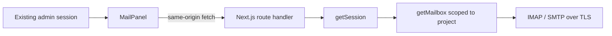

<div align="center">
  
  <h1>MailInlay</h1>
  <p><strong>Embeddable IMAP/SMTP mailbox for React and Next.js admin panels — with no separate login.</strong></p>

  [](https://github.com/SebastianPRM/MailInlay/actions/workflows/ci.yml)
  
  
  
</div>

MailInlay adds a project mailbox directly to an existing administration panel. The administrator signs in to the host application once; MailInlay reuses that session while IMAP and SMTP credentials remain on the server.


<details>
  <summary>Horizontal admin navigation</summary>
  <br />
  
</details>

> Screenshots use fictional demonstration data. No production mailbox data or credentials are included in this repository.

## Highlights

- one React component and one Next.js catch-all route;
- no second login, user database, worker, queue or synchronization service;
- IMAP folders, counters, pagination and server-side header search;
- sanitized HTML, remote-image blocking and protected attachment downloads;
- seen/unseen, starred, move, Trash and permanent delete only from Trash;
- compose, CC, BCC, attachments, signatures, Reply, Reply All and Forward;
- SMTP delivery with an IMAP Sent copy and partial-success handling;
- container-query responsive UI suitable for different admin layouts;
- server-side TLS, strict limits, same-origin mutations and `no-store` responses.

## Architecture



Each request authenticates the current panel session, resolves a mailbox limited to the active project, opens one short-lived mail-server connection and closes it in `finally`. Credentials are never serialized to the browser.

## Install from GitHub

Pin applications to a release tag:

```bash
npm install "git+https://github.com/SebastianPRM/MailInlay.git#v0.1.0"
```

The installed package exposes:

```text
@mailinlay/sdk/react
@mailinlay/sdk/next
@mailinlay/sdk/styles.css
```

Node.js 20 or newer is required. The backend adapter needs the Node.js runtime, not an Edge runtime.

## Add the React panel

Import the stylesheet once in the application layout:

```tsx
import "@mailinlay/sdk/styles.css"
```

Render MailInlay inside the authenticated project area:

```tsx
import { MailPanel } from "@mailinlay/sdk/react"

export default function ProjectMailPage() {
  return <MailPanel apiBase="/api/admin/mail" mailboxId="main" />
}
```

Give the parent a usable height and `min-height: 0`. MailInlay adapts to the component container rather than the full viewport.

## Add the Next.js route

Create `app/api/admin/mail/[...mailinlay]/route.ts`:

```ts
import { createMailInlayHandler } from "@mailinlay/sdk/next"
import { getMailbox, getSession } from "@/lib/mailinlay"

export const runtime = "nodejs"
export const dynamic = "force-dynamic"
export const maxDuration = 30

export const { GET, POST, PATCH, DELETE } = createMailInlayHandler({
  getSession,
  getMailbox,
})
```

## Connect the host session

MailInlay deliberately provides no authentication UI. Adapt the existing session:

```ts
import type { GetSession } from "@mailinlay/sdk/next"
import { auth } from "@/lib/auth"

export const getSession: GetSession = async () => {
  const session = await auth()
  if (!session?.user?.id || !session.projectId) return null

  return {
    userId: session.user.id,
    projectId: session.projectId,
  }
}
```

Resolve the mailbox by both `mailboxId` and the authenticated project. The identifier alone is never an authorization check:

```ts
import type { GetMailbox } from "@mailinlay/sdk/next"
import { db } from "@/lib/db"
import { decrypt } from "@/lib/secrets"

export const getMailbox: GetMailbox = async ({ mailboxId, session }) => {
  const row = await db.mailbox.findFirst({
    where: {
      id: mailboxId,
      projectId: session.projectId,
      active: true,
    },
  })

  if (!row) return null

  const password = await decrypt(row.encryptedPassword)

  return {
    id: row.id,
    email: row.email,
    displayName: row.displayName,
    imap: {
      host: row.imapHost,
      port: row.imapPort,
      secure: row.imapSecure,
      username: row.email,
      password,
    },
    smtp: {
      host: row.smtpHost,
      port: row.smtpPort,
      secure: row.smtpSecure,
      username: row.email,
      password,
    },
    signatureHtml: row.signatureHtml,
    saveToSent: true,
  }
}
```

## Security model

- `getSession` and project-scoped `getMailbox` run for every request;
- mailbox secrets exist only in server memory and never use `NEXT_PUBLIC_*`;
- TLS certificates are verified and all connections have short timeouts;
- POST, PATCH and DELETE require an exact same-origin `Origin` header;
- sender identity is forced from the server-side mailbox configuration;
- incoming and outgoing HTML use strict allowlists;
- external images remain inactive until the user explicitly reveals them;
- attachment and message sizes are limited before expensive processing;
- permanent delete is rejected outside a recognized Trash folder;
- mail and attachment responses use `Cache-Control: private, no-store`;
- package and browser bundles are checked to ensure they contain no mailbox password.

See [SECURITY.md](SECURITY.md) for reporting and production guidance.

## Local development

```bash
cp .env.example .env.local
npm ci
npm run dev
```

Open [http://localhost:4173](http://localhost:4173). The bundled demonstration session is enabled only when `MAILINLAY_DEMO_MODE=true` and both the URL and Host header resolve to a local hostname. Replace it with the real host application's session in production.

Quality commands:

```bash
npm test
npm run typecheck
npm run build
npm audit
npm pack --dry-run
```

## Intentional scope

MailInlay does not include a database, a second authentication system, background sync, workers, WebSockets, IMAP IDLE, email threads, drafts, OAuth or automatic forwarding of original attachments. These limits keep the integration small, auditable and Vercel-friendly.

## Ownership

Created and maintained solely by **Sebastian Pawelczyk** ([@SebastianPRM](https://github.com/SebastianPRM)). Repository ownership is enforced through CODEOWNERS and GitHub access controls. External changes have no effect unless explicitly accepted by the owner.

Copyright © 2026 Sebastian Pawelczyk. All rights reserved. This repository is publicly visible but is not open-source software. See [LICENSE](LICENSE).
