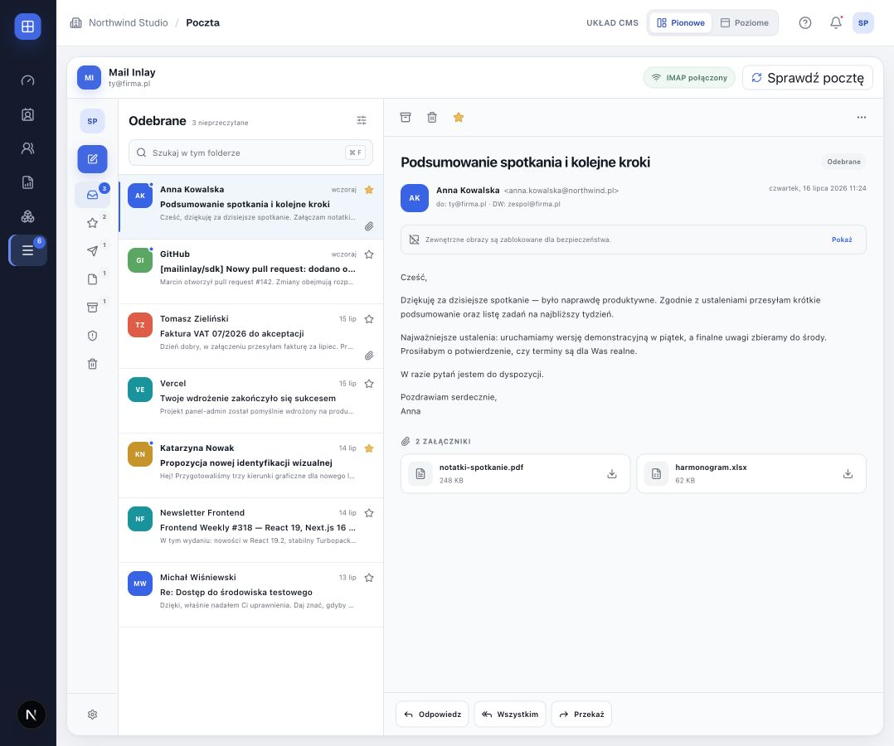
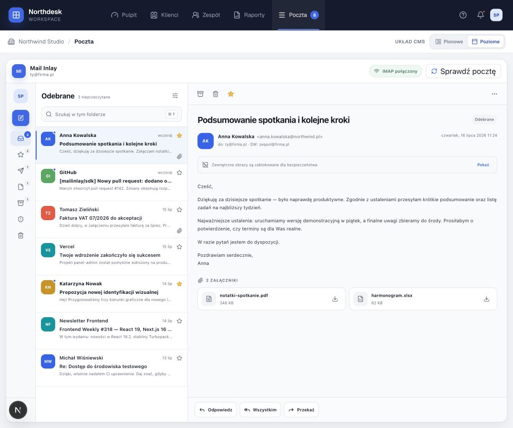
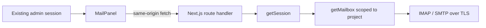

<div align="center">
  
  <h1>MailInlay</h1>
  <p><strong>Embeddable IMAP/SMTP mailbox for React and Next.js admin panels — with no separate login.</strong></p>

  [](https://github.com/SebastianPRM/MailInlay/actions/workflows/ci.yml)
  
  
  
</div>

MailInlay adds a project mailbox directly to an existing administration panel. The administrator signs in to the host application once; MailInlay reuses that session while IMAP and SMTP credentials remain on the server.



<details>
  <summary>Horizontal admin navigation</summary>
  <br />
  
</details>

> Screenshots use fictional demonstration data. No production mailbox data or credentials are included in this repository.

## Highlights

- one React component and one Next.js catch-all route;
- no second login, user database, worker, queue or synchronization service;
- IMAP folders, counters, pagination, server-side header search and unread-only filter;
- sanitized HTML, remote-image blocking, inline `cid:` images and protected attachment downloads;
- seen/unseen, starred, move, Trash and permanent delete only from Trash;
- compose, CC, BCC, attachments, signatures, Reply, Reply All and Forward;
- SMTP delivery with an IMAP Sent copy and partial-success handling;
- container-query responsive UI suitable for different admin layouts;
- server-side TLS, strict limits, send rate limiting, same-origin mutations and `no-store` responses.

## Architecture



Each request authenticates the current panel session, resolves a mailbox limited to the active project, opens one short-lived mail-server connection and closes it in `finally`. Credentials are never serialized to the browser.

## Install from GitHub

Pin applications to a release tag:

```bash
npm install "git+https://github.com/SebastianPRM/MailInlay.git#v0.3.1"
```

The installed package exposes:

```text
@mailinlay/sdk/react
@mailinlay/sdk/next
@mailinlay/sdk/styles.css
```

Node.js 20 or newer is required. The backend adapter needs the Node.js runtime, not an Edge runtime.

## Add the React panel

Import the stylesheet once in the application layout:

```tsx
import "@mailinlay/sdk/styles.css"
```

Render MailInlay inside the authenticated project area:

```tsx
import { MailPanel } from "@mailinlay/sdk/react"

export default function ProjectMailPage() {
  return (
    <div style={{ display: "flex", height: "100%", minHeight: 0 }}>
      <MailPanel
        apiBase="/api/admin/mail"
        mailboxId="main"
        defaultFoldersCollapsed
        onOpenSettings={() => openMailboxSettings()}
      />
    </div>
  )
}
```

Give the parent a usable height and `min-height: 0`. `MailPanel` uses `flex: 1`,
`min-width: 0` and `min-height: 0`; its folder list, message list and reader then
scroll independently. It does not require a fixed or minimum 640 px height and
adapts to the component container rather than the full viewport. The host page
header and footer stay outside MailInlay.

### Folder panel and settings integration

The desktop folder panel can be uncontrolled or controlled by the host:

```tsx
// Uncontrolled, initially compact
<MailPanel defaultFoldersCollapsed apiBase="/api/admin/mail" mailboxId="main" />

// Controlled
<MailPanel
  apiBase="/api/admin/mail"
  mailboxId="main"
  foldersCollapsed={foldersCollapsed}
  onFoldersCollapsedChange={setFoldersCollapsed}
/>
```

At medium widths the panel automatically becomes an icon rail. On phones it is
replaced by the existing drawer. Manual collapsing does not change the drawer.

Settings remain owned by the host application. Pass `onOpenSettings` to render
an active settings button in the top bar; without the callback no placeholder
button is rendered. `showSettings={false}` hides it explicitly. MailInlay never
accepts or displays IMAP/SMTP passwords in the browser.

### Theme tokens

All public theme tokens are namespaced and can safely reference host variables:

```css
.project-mail {
  --mi-color-background: var(--app-background);
  --mi-color-foreground: var(--app-foreground);
  --mi-color-card: var(--app-card);
  --mi-color-primary: var(--app-primary);
  --mi-color-primary-foreground: var(--app-primary-foreground);
  --mi-color-muted: var(--app-muted);
  --mi-color-muted-foreground: var(--app-muted-foreground);
  --mi-color-border: var(--app-border);
  --mi-color-sidebar: var(--app-sidebar);
  --mi-color-sidebar-accent: var(--app-sidebar-accent);
  --mi-font-family: var(--app-font-family);
  --mi-font-size-ui: 12px;
  --mi-font-size-meta: 10.5px;
  --mi-font-size-body: 14px;
  --mi-radius: 12px;
}
```

Apply `project-mail` through the `className` prop. If the composer portal should
use the same custom tokens, define them on a shared ancestor such as `:root` or
`body`. Change these tokens in the host's dark-mode selector to theme every
MailInlay surface, editor tool and attachment. The legacy `--mi-background`,
`--mi-text`, `--mi-surface`, `--mi-primary`, `--mi-muted` and `--mi-border`
variables remain supported for v0.3.0 integrations, but MailInlay no longer
defines or depends on global names such as `--primary` or `--background`.

## Add the Next.js route

Create `app/api/admin/mail/[...mailinlay]/route.ts`:

```ts
import { createMailInlayHandler } from "@mailinlay/sdk/next"
import { getMailbox, getSession } from "@/lib/mailinlay"

export const runtime = "nodejs"
export const dynamic = "force-dynamic"
export const maxDuration = 60

export const { GET, POST, PATCH, DELETE } = createMailInlayHandler({
  getSession,
  getMailbox,
})
```

Mutating requests must carry an `Origin` header that matches the request URL.
If the panel runs behind a reverse proxy whose internal origin differs from the
public one, either forward `X-Forwarded-Host`/`X-Forwarded-Proto` correctly or
list the public origin explicitly:

```ts
export const { GET, POST, PATCH, DELETE } = createMailInlayHandler({
  getSession,
  getMailbox,
  allowedOrigins: ["https://panel.example.com"],
})
```

## Connect the host session

MailInlay deliberately provides no authentication UI. Adapt the existing session:

```ts
import type { GetSession } from "@mailinlay/sdk/next"
import { auth } from "@/lib/auth"

export const getSession: GetSession = async () => {
  const session = await auth()
  if (!session?.user?.id || !session.projectId) return null

  return {
    userId: session.user.id,
    projectId: session.projectId,
  }
}
```

Resolve the mailbox by both `mailboxId` and the authenticated project. The identifier alone is never an authorization check:

```ts
import type { GetMailbox } from "@mailinlay/sdk/next"
import { db } from "@/lib/db"
import { decrypt } from "@/lib/secrets"

export const getMailbox: GetMailbox = async ({ mailboxId, session }) => {
  const row = await db.mailbox.findFirst({
    where: {
      id: mailboxId,
      projectId: session.projectId,
      active: true,
    },
  })

  if (!row) return null

  const password = await decrypt(row.encryptedPassword)

  return {
    id: row.id,
    email: row.email,
    displayName: row.displayName,
    imap: {
      host: row.imapHost,
      port: row.imapPort,
      secure: row.imapSecure,
      username: row.email,
      password,
    },
    smtp: {
      host: row.smtpHost,
      port: row.smtpPort,
      secure: row.smtpSecure,
      username: row.email,
      password,
    },
    signatureHtml: row.signatureHtml,
    saveToSent: true,
  }
}
```

## Relay for hosts that block mail ports

Some platforms (for example DigitalOcean) block outbound SMTP ports, and many
mail providers offer no alternative port. For that case MailInlay ships a
stateless relay: a separate deployment (typically on Vercel, which does not
block IMAP/SMTP) that performs the mail-server connections, while sessions and
mailbox credentials stay entirely in the host application.

How it works: the panel keeps its normal `getSession` and `getMailbox`. Instead
of connecting to the mail server itself, it forwards each request to the relay
with the mailbox configuration encrypted per request (AES-256-GCM, shared
secret). The relay authenticates the call with a derived bearer token, decrypts
the configuration only in memory, performs the IMAP/SMTP operation and returns
the response. It stores nothing and serves any number of panels that hold the
same secret — or deploy one relay per organization with its own secret.

In the host application, replace `createMailInlayHandler` with the proxy:

```ts
import { createMailInlayProxy } from "@mailinlay/sdk/next"
import { getMailbox, getSession } from "@/lib/mailinlay"

export const runtime = "nodejs"
export const dynamic = "force-dynamic"
export const maxDuration = 60

export const { GET, POST, PATCH, DELETE } = createMailInlayProxy({
  relayUrl: "https://my-relay.vercel.app/api/relay",
  secret: process.env.MAILINLAY_RELAY_SECRET!,
  getSession,
  getMailbox,
})
```

The relay is a fresh Next.js project with a single route,
`app/api/relay/[...mailinlay]/route.ts`:

```ts
import { createMailInlayRelay } from "@mailinlay/sdk/next"

export const runtime = "nodejs"
export const dynamic = "force-dynamic"
export const maxDuration = 60

export const { GET, POST, PATCH, DELETE } = createMailInlayRelay({
  secret: process.env.MAILINLAY_RELAY_SECRET!,
})
```

Generate the shared secret with `openssl rand -base64 48` (minimum 32
characters) and set the same value on both sides. Relay notes:

- the relay stores no mailbox data; credentials exist only in request memory;
- the encrypted configuration additionally protects against accidental header
  logging on the relay platform;
- the send rate limit applies on the relay per forwarded panel user;
- the browser never talks to the relay — only the panel backend does;
- keep the relay URL private and rotate the secret if it ever leaks.

## Security model

- `getSession` and project-scoped `getMailbox` run for every request;
- mailbox secrets exist only in server memory and never use `NEXT_PUBLIC_*`;
- TLS certificates are verified and all connections have short timeouts;
- POST, PATCH and DELETE require an exact same-origin `Origin` header
  (extra origins only via the explicit `allowedOrigins` option);
- sending is rate limited per session (10 messages per minute, per instance);
- sender identity is forced from the server-side mailbox configuration;
- incoming and outgoing HTML use strict allowlists;
- external images remain inactive until the user explicitly reveals them;
- inline `cid:` images are served only through the protected attachment endpoint;
- attachment and message sizes are limited before expensive processing;
- `In-Reply-To` and `References` headers are length-limited and CRLF-checked;
- permanent delete is rejected outside a recognized Trash folder;
- mail and attachment responses use `Cache-Control: private, no-store`;
- the bundled demo session is hard-disabled in production builds;
- package and browser bundles are checked to ensure they contain no mailbox password.

See [SECURITY.md](SECURITY.md) for reporting and production guidance.
The owner checklist for repository access, branch rules and GitHub security is
available in [docs/GITHUB_SETTINGS.md](docs/GITHUB_SETTINGS.md).

## Local development

```bash
cp .env.example .env.local
npm ci
npm run dev
```

Open [http://localhost:4173](http://localhost:4173). The bundled demonstration session is enabled only when `MAILINLAY_DEMO_MODE=true` and both the URL and Host header resolve to a local hostname. Replace it with the real host application's session in production.

Quality commands:

```bash
npm test
npm run typecheck
npm run build
npm audit
npm pack --dry-run
```

## Intentional scope

MailInlay does not include a database, a second authentication system, background sync, workers, WebSockets, IMAP IDLE, email threads, drafts, OAuth or automatic forwarding of original attachments. These limits keep the integration small, auditable and Vercel-friendly.

## Ownership

Created and maintained solely by **Sebastian Pawelczyk** ([@SebastianPRM](https://github.com/SebastianPRM)). Repository ownership is enforced through CODEOWNERS and GitHub access controls. External changes have no effect unless explicitly accepted by the owner.

Copyright © 2026 Sebastian Pawelczyk. All rights reserved. This repository is publicly visible but is not open-source software. See [LICENSE](LICENSE).
